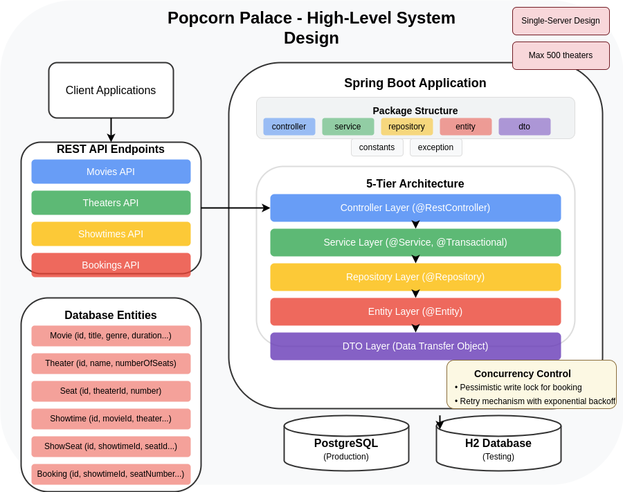
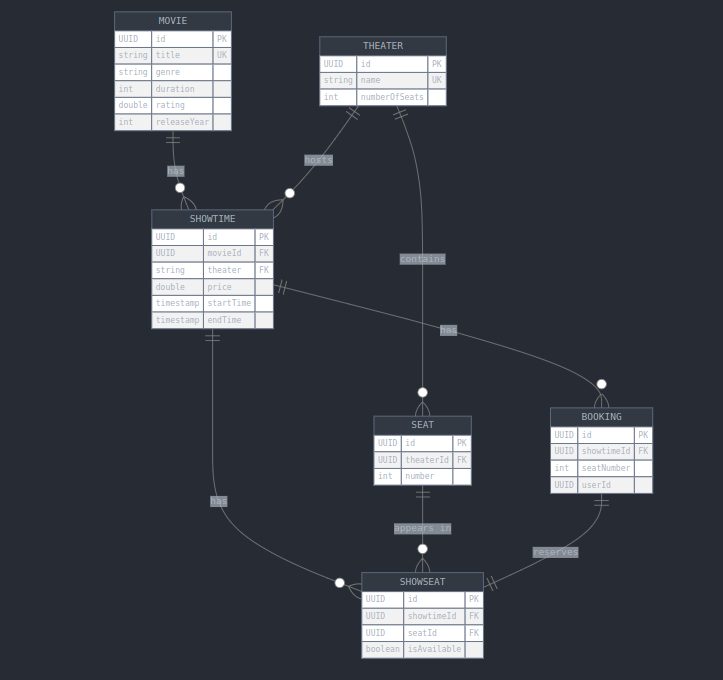

# Popcorn Palace Movie Ticket Booking System - Design Documentation

## Overview
The Popcorn Palace Movie Ticket Booking System is a backend service designed to handle various operations related to movie,showtime, and booking management.

**Note:** Through this design, readme.md is being treated as a superior source of truth, but - more assumptions and design considerations are given.

## Requirements (Provided by readme.md file)
### Functional Requirements
- Manage movies available on the platform (CRUD operations)
- Manage showtime available on the theaters (CRUD operations)  
Constraint: No overlapping showtimes for the same theater
- Manage movie tickets booking (add)
- **additional** - Manage theaters (add)
### Non-Functional Requirements
- Concurrency Handling - Ensure no seat is booked twice for the exact showtime.
- Input Validation & Error Handling: 
        - Not allowing invalid values into the API
        - In case of error, Ensure return of an informative error.
- Testing - relevant tests to the code implementation
    • Spring boot - https://docs.spring.io/spring-boot/reference/testing/index.html
- Provision of well-documented readme file (Instructions.md), on how to run build and test the project.

## Application Architecture
[Application architecture details](architecture.md)

## System Interface Definitions 

### External API - Summary

#### Movies API
| API Description           | Endpoint                    |
|---------------------------|-----------------------------|
| Get all movies            | GET /movies/all             |
| Add a movie               | POST /movies                |
| Update a movie            | PUT /movies/update/{title}  |
| Delete a movie            | DELETE /movies/{title}      |

#### Theaters API
| API Description           | Endpoint                    |
|---------------------------|-----------------------------|
| Get all theaters          | GET /theaters/all           |
| Get theater by ID         | GET /theaters/{id}          |
| Create a theater          | POST /theaters              |

#### Showtimes API
| API Description           | Endpoint                    |
|---------------------------|-----------------------------|
| Get showtime by ID        | GET /showtimes/{id}         |
| Get all showtimes         | GET /showtimes/all          |
| Add a showtime            | POST /showtimes             |
| Update a showtime         | PUT /showtimes/update/{id}  |
| Delete a showtime         | DELETE /showtimes/{id}      |

#### Bookings API
| API Description           | Endpoint       |
|---------------------------|----------------|
| Book a ticket             | POST /bookings |

For further info - [interface internal API details](./interface/external.md)

### Internal API
[interface internal API details](./interface/internal.md)

## Data Modeling

### Database Schema
The system uses several entities:
- **Movie**: Stores movie details 
- **Theater**: Represents theaters where movies are shown 
- **Seat**: Represents individual seats in a theater 
- **Showtime**: Links a movie to a theater with timing information (start/end times etc.)
- **ShowSeat**: Tracks availability of seats for specific showtimes 
- **Booking**: Records ticket bookings 

### Details

   #### Movie
   - **id**: UUID
   - **title**: String, Unique
   - **genre**: String
   - **duration**: int, > 0 (in minutes)
   - **rating**: double, 0.0 <= x <= 10.0
   - **releaseYear**: int, > 1880

   #### Showtime
   - **id**: UUID
   - **movieId**: UUID, Foreign Key to Movie
   - **price**: double, > 0.0
   - **theater**: String, Unique
   - **startTime**: Timestamp, Valid ISO 8601 format
   - **endTime**: Timestamp, Valid ISO 8601 format, > startTime

   #### Booking
   - **id**: UUID
   - **showtimeId**: UUID, Foreign Key to Showtime
   - **seatNumber**: int, > 0 , within the range of numberOfSeats in the theater of showtime
     (Validation: During booking creation, the system checks if the `seatNumber` is greater than 0 and less than or equal to the `numberOfSeats` in the theater associated with the showtime.)
   - **userId**: UUID, Non-Empty

   #### Theater
   - **id**: UUID
   - **name**: String, Unique, Non-Empty
   - **numberOfSeats**: int, > 0, Default: 100

   #### ShowSeat
   - **id**: UUID
   - **showtimeId**: UUID, Foreign Key to Showtime
   - **seatId**: UUID, Foreign Key to Seat
   - **isAvailable**: boolean, Default: true

   #### Seat
   - **id**: UUID
   - **theaterId**: UUID, Foreign Key to Theater
   - **number**: int, > 0

### Entity Relationships
- Movie -> Showtime: 1-to-Many
- Showtime -> Booking: 1-to-Many
- Showtime -> Theater: Many-to-1
- Showtime -> ShowSeat: 1-to-Many
- Booking -> ShowSeat: 1-to-1
- Theater -> Seat: 1-to-Many
- Seat -> ShowSeat: 1-to-Many

### Data CRUD Dependencies
1. Movie CRUD Operations - effects itself and Showtime -> if deleted 
   corresponding showtimes need to be deleted too
2. Showtime CRUD Operations - effects itself and:
   1. Booking: if deleted corresponding Bookings need to be deleted too
   2. ShowSeat: if deleted corresponding ShowSeats need to be deleted too
3. Adding Booking - effects itself and:
   1. ShowSeat: if booking is added - corresponding ShowSeat's isAvailable attribute is changed to false. corresponding ShowSeat is found by showtimeId and SeatID.
   - **How is seatId found if showtimeId and SeatNumber is given?** looking in showtime table for showtimeId can get us Theater Name -> looking for Theater Name in Theater database gets us
   theaterId -> looking for theaterId in Seat Database with SeatNumber gives us seatId.
4. Adding Theater - effect itself and:
   1. Seat: if new Theater is added -> new Seat objects are created and added to Seat Database with corresponding theaterId and seat number (default is 100 seats which are numbered 1-100)

## Design Considerations
### Assumptions
For the sake of simplicity and time considerations - This design will assume the following:
1. **No user creation/authentication** 
    (user id is given in booking API, assume user registration + password is done elsewhere) 
2. **no different user roles** 
    (admin, client etc.)
3. **One server is needed** 
    (of course in practice - this is highly unreliable - assuming this is a service that serves millions of requests - more than one server is needed, load balancer is needed etc.)
4. **One database is needed**
    (for the same reason given in 3 - I assume that if we were to talk realisticly - then database partioning would be needed (sharding), 
   I would assume the logical thing to partition by here is according to geographic location, also for reliability - a replica of the database would be needed - so it won't be a single point of failure)
5. **Geographic location is not of importance**.  of course in reality - it would be of some importance for the database partioning and better data management in general (See 4.1)
6. **Movie/Theater names are unique**
     (for simplicity and as derivation from the given movies API by the readme.md file)

### Technical Aspects
1. The system is built using **Java Spring Boot** - robust **framework for creating RESTful APIs**. 
2. **Data persistence** is managed using **PostgreSQL** as a robust **solution for production**.
3. **Data persistence** is managed using **H2** that mimics PostgreSQL as a **solution for test**.

#### Technical Constraints
- **PostgreSQL installed and tested locally without using Docker** - developer computer do not support virtualization - docker solution can not be successfully verified to work. 

#### Transaction Management

Transaction management is handled using Spring's declarative transaction management:

- `@Transactional` at the service layer
- Configuration of isolation levels as needed:
  - `REPEATABLE_READ` for booking operations
  - `SERIALIZABLE` for theater creation
  - `READ_COMMITTED` for most other operations

### Capacity Estimations
[See Capacity Estimations file](capacity_estimations.md)

## Implementation Considerations
1. 1 booking can book 1 seat
   1. Again, this is done for the sake of simplicity and for the sake of adhering to the API given in readme.md
   2. realisticly speaking - after inspecting cinema city web - i would probably go for a max of 10 seats, 
   but that would require defining more assumptions for simplicity such as all-or-nothing booking or maybe different handling like building a choosing mechanism that enables appending
   seats to chosen seats and blocking the seats chosen for a window of time - and if the seat being chosen is already taken - handle it gracefully by returning to 
   the client that the seat is already taken.
2. theater Seats are are numbered, without regard to row (i.e. 1-100)
 For simplicity and adhering to API given in readme.md

3. Concurrency Handling:
The system handles concurrent (double) booking attempts using:
   - Repeatable Read isolation level for booking transactions
   - Pessimistic write locks for seat reservation
   - Retry mechanism with exponential backoff

4.  Theaters must be explicitly created through the Theater API endpoint before they can be used in showtimes:
       1. The SQL isolation level that will be used for the transaction of adding new theater will be Serialized - to make sure there is no chance of concurrency problems when dealing with this type of object.
       2. The system will limit the addition of new theaters to 500 objects. If this limit is reached, a client will receive an exception with information about the current theaters.
       3. Each theater has a configurable number of seats (defaulting to 100 if not specified).

## Future possible enhancements:
[See the todo list](todo.md)
